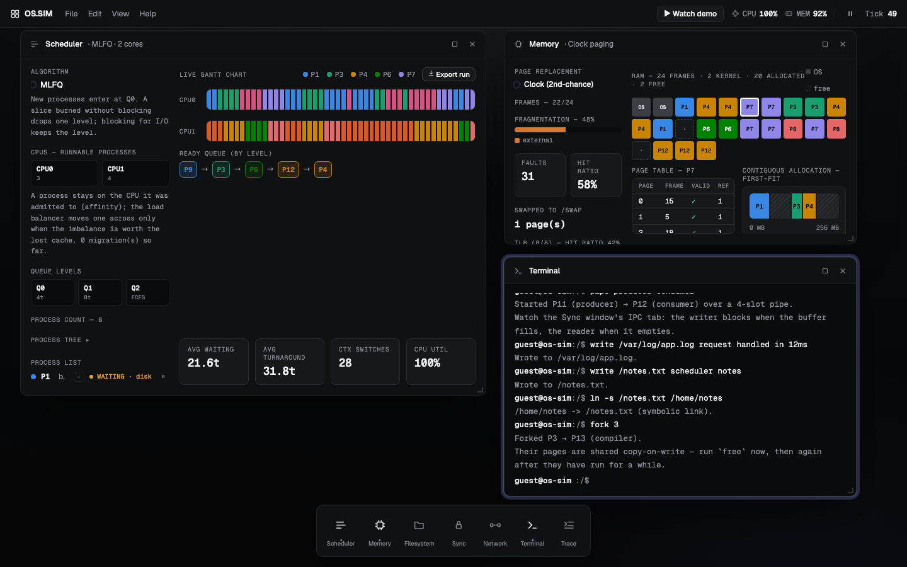
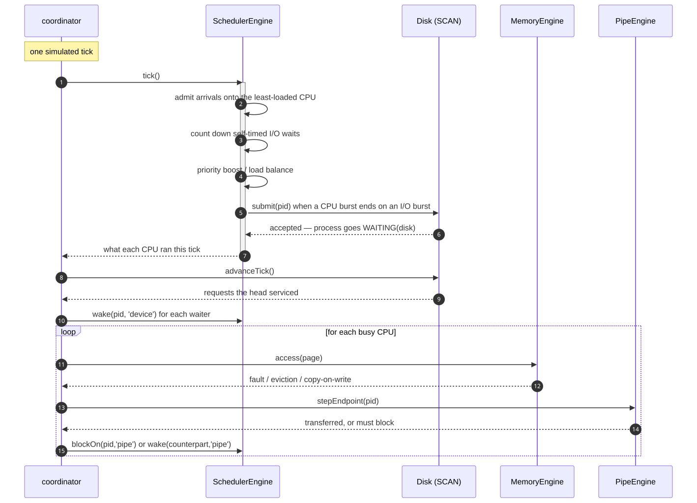
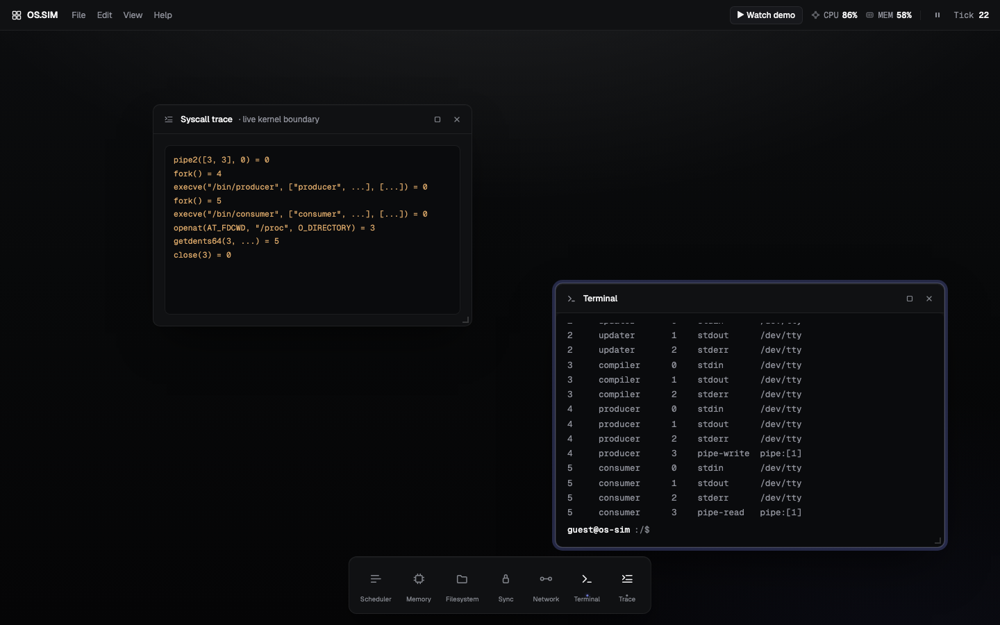
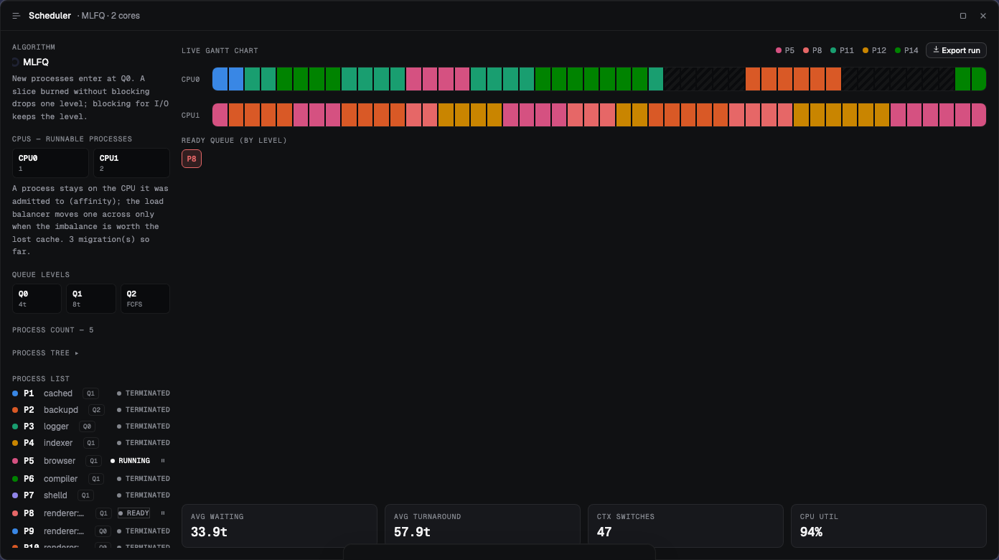
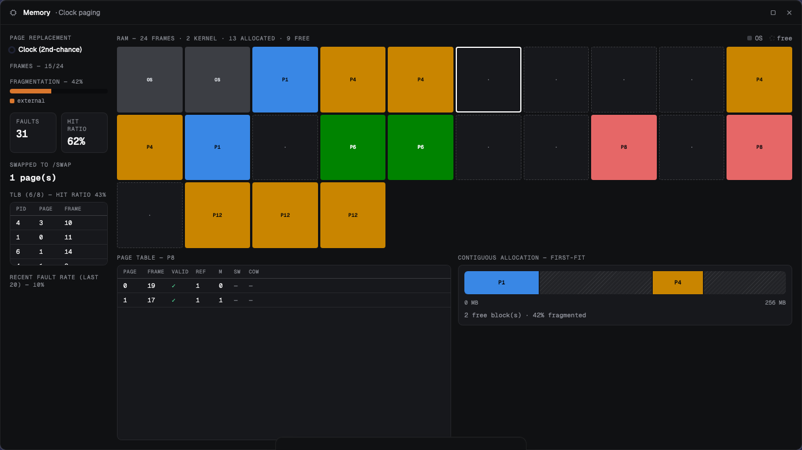
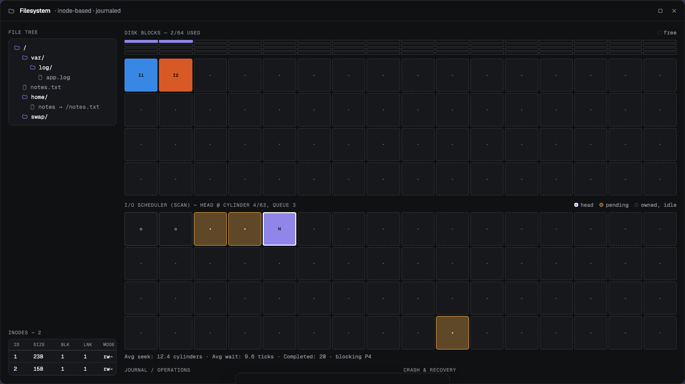
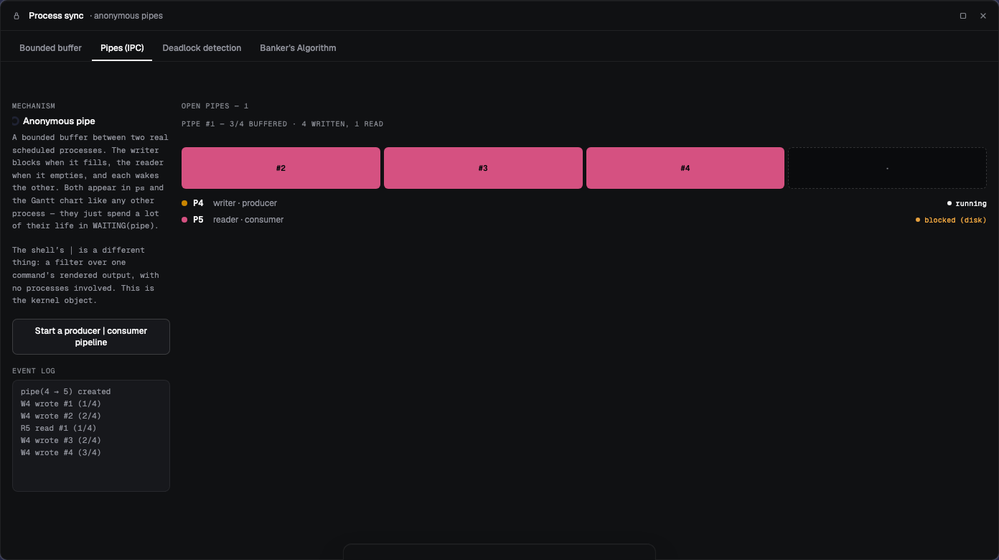

# OS.SIM

An operating system's core subsystems, running in a browser tab: a multi-core MLFQ scheduler, a demand-paged memory manager, a journaling filesystem on a simulated disk, pipes, semaphores and a shell to poke at all of it.

The algorithms are real implementations, not animations with a timer behind them. The environment they run in is simulated.



## What this is

I wanted to understand operating systems by building one rather than reading about one, and I wanted the result to be something you could look at. So the scheduler is an actual Multi-Level Feedback Queue with real demotion rules, the pager is an actual Clock replacement algorithm with a real TLB in front of it, and the filesystem has a write-ahead log you can crash and recover.

What you get is a desktop with a window per subsystem, all driven by one shared clock. Type `stress 8` and watch processes get demoted through the queue levels. Type `crash` then `fsck` and watch the journal replay. Type `fork 3` and watch two processes share memory until one of them writes.

There is no algorithm picker and no "add process" button. You interact with it the way you'd interact with a machine: through a shell.

**Don't know what to type?** Click **▶ Watch demo** in the menu bar. It types and runs a scripted tour through every subsystem.

## Running it

```bash
npm install
npm run dev          # dev server
npm run build        # production build to dist/
npm test             # unit, property and component tests
npm run test:e2e     # Playwright smoke test against the built app
npm run lint
npm run typecheck
```

The E2E run needs browser binaries once: `npx playwright install chromium`.

## What's real and what isn't

This matters, so it's worth being blunt about.

**Real:** every algorithm. MLFQ, Clock/Second-Chance, SCAN elevator scheduling, the write-ahead log and its replay, counting semaphores, wait-for-graph deadlock detection, Banker's safety algorithm, copy-on-write page sharing, the free-space bit vector. Each is plain TypeScript with no React or store coupling, unit-tested against hand-traced scenarios the way you'd check a textbook example on paper.

**Simulated:** the machine. There is no hardware, no ring 0, no MMU translating addresses per instruction, no real parallelism. Every "CPU" is dispatched inside one single-threaded tick, so there are no true data races. (The race-condition demo in the sync module is an explicit model of one, not an actual race.) The filesystem lives in IndexedDB, not on a block device. The network module animates packets; there's no TCP/IP stack under it.

What I've tried hard to avoid is the middle ground: something that looks like a mechanism but is really a lookup table. When I found one, I removed it. The syscall trace used to be a static map from command name to plausible-looking output. Now it wraps the actual boundary and reports what really crossed it, byte counts and pids included.

## Concepts and mechanisms

### Process scheduling

**Multi-Level Feedback Queue.** Three levels with quanta of 4, 8 and unbounded (FCFS at the bottom). The rules:

1. A higher queue always preempts a lower one.
2. Processes at the same level round-robin on that level's quantum.
3. A process that blocks for I/O before its slice expires keeps its level. Yielding voluntarily isn't punished.
4. A process that burns a whole slice without blocking drops one level.
5. Every 50 ticks everything returns to the top, so a long batch job can't starve an interactive one forever.

MLFQ is here rather than round-robin or SJF because it's what general-purpose kernels actually approximate, and because it adapts to interactive versus batch workloads without anyone tuning it.

**Multiple CPUs.** The scheduler runs over two logical CPUs, each with its own complete set of queues. A process is assigned a CPU when admitted and stays there through preemption, demotion, I/O and priority boosts. That's processor affinity, and it's why per-CPU queues beat one shared queue here: a shared queue needs neither affinity nor balancing, so it demonstrates neither.

Pulling against affinity is a load balancer. Every 20 ticks it compares how many runnable processes each CPU has and migrates one if the difference is 2 or more. Moving on a difference of 1 would leave two cores swapping the same process back and forth, since the move just inverts the imbalance. The process it takes comes from the front of the busiest CPU's lowest-priority queue: batch work that has waited longest, so the coldest cache and the least lost by moving it.

**Process states.**

<picture>
  <source media="(prefers-color-scheme: dark)" srcset="docs/diagrams/process-states-dark.svg">
  
</picture>

The interesting state is `WAITING`, because a process can be waiting for genuinely different things and it matters which. `ps` shows `WAITING(disk)`, `WAITING(pipe)` or `WAITING(io)` rather than a bare state, and the reason is recorded on the process rather than inferred. That sounds like a detail but isn't: the original code worked out what a process was waiting for from the parity of its burst index, which held only while a self-timed I/O burst was the sole possible reason to wait.

### Blocking on a real device

A process's I/O burst is a request to the disk, not a countdown. When a CPU burst ends and the next burst is an I/O one, the scheduler hands it to the disk, and the process sits in `WAITING` until the SCAN head reaches its cylinder and something wakes it.

This is the seam that turns the project from four parallel simulations into one system. Before it, the scheduler counted I/O bursts down by itself while the disk queue was fed only by file operations. `cat` moved the head but blocked nothing, and a process in `WAITING` produced no disk activity. The Gantt chart and `iostat` described two unrelated worlds that happened to share a clock.

`SchedulerEngine` stays free of any knowledge of disks. It takes a port:

```ts
export interface IoPort {
  submit(pid: number, sizeHint: number): boolean
}
```

Return `true` and the device owns the wait. Return `false` — a crashed disk does — and the scheduler falls back to its own countdown, so a process can never be lost. The real implementation is installed by the coordinator, not by either engine.

### Virtual memory

**Demand paging with Clock replacement.** 24 frames, a page table per process, pages faulted in on first touch. Clock (Second-Chance) is the replacement policy: a sweeping hand gives every frame one reprieve before evicting it. Real kernels use it because exact LRU needs reference tracking that hardware doesn't cheaply provide.

**TLB.** An 8-entry translation cache in front of the page table, LRU-evicted, invalidated whenever a page is really evicted. It's small on purpose. A TLB that mirrored the page table 1:1 would sit at a 100% hit rate and demonstrate nothing; at 8 entries you can watch the ratio move and see why the indirection is affordable.

**Swap.** An evicted page is written to a real file under `/swap` on the simulated disk and read back on the next fault. `MemoryEngine` only records *that* a page is swapped; writing the file is the coordinator's job, so memory and filesystem stay unaware of each other.

**Thrashing.** A sliding window over the last 20 accesses. When more than 70% of them fault, the system is spending more time paging than working, and the Memory window says so. `stress 12` is the quickest way to trigger it.

**fork() and copy-on-write.** `fork <pid>` gives the child its own page table pointing at the parent's frames, marked read-only on both sides. Nothing is copied. The first write by either process traps, copies that one frame, and clears the flag:

<picture>
  <source media="(prefers-color-scheme: dark)" srcset="docs/diagrams/cow-dark.svg">
  
</picture>

Run `free` right after a fork and memory usage hasn't moved; run it again once both have been scheduled a while and it climbs. Three consequences of sharing are easy to get wrong, so each has its own test: evicting a shared frame has to invalidate *every* mapping of it, not just the owner's; freeing one process must not free a frame another still reads; and a frame down to one mapping stops being copy-on-write, or that process pays a second pointless copy.

### Filesystem

**Inodes over a block device.** 64 blocks, files as inodes with block lists, directories as a tree. Hard links are real: `Inode.links` is a count, and blocks are freed only when the last name pointing at an inode goes away.

**Journaling.** Every mutation is written to a write-ahead log as pending, applied, then marked committed. `crash` simulates power loss by logging an entry and never applying it, leaving a filesystem that rejects further writes. `fsck` replays what's pending. This is the idea of journaling rather than the crash-consistency guarantees of a production filesystem, and it's demonstrable in two commands.

**Free space as a bit vector.** One bit per block packed into 32-bit words, so finding a free block skips a fully allocated word with a single comparison instead of 32 tests. The filesystem always knew which blocks were free, but until this existed it knew implicitly, by scanning every block for a null owner, which left the actual subject — how free space is *represented* — unmodelled. `df -m` prints the vector.

**Symbolic links** sit next to hard links deliberately, because the contrast is the point. A hard link is a second name for one inode. A symlink stores a *path*, so it can dangle, `rm` on it removes the link rather than the target, and following a cycle stops at 8 levels with `ELOOP`. All of it lives in one function that rewrites a path with links resolved, which is why nothing below it needed to change.

**Disk scheduling: SCAN.** Every physical block access queues a request. The head sweeps end to end, servicing everything it passes and reversing only at the ends. An idle disk parks rather than sweeping for nothing, which keeps the average-seek figure meaningful. `iostat` reports head position, queue depth, seek and wait averages, and which processes are blocked on it right now.

### Interprocess communication

`pipe <writer> <reader>` spawns two real processes and connects them with a bounded buffer. The writer blocks when it fills, the reader when it empties, and each wakes the other. Both appear in `ps` and the Gantt chart like any other process; they just spend a lot of their lives in `WAITING(pipe)`.

The shell's `|` is a different thing, and the docs say so. It's a filter over one command's rendered output, with no processes and no channel involved. Making `|` a real pipe would need these commands to be long-running processes with a stdout, which is a much bigger project. Overloading the symbol quietly would have been worse than having two.

A terminating endpoint closes its end and releases whoever was parked on the other. Without that, a reader blocked on an empty pipe whose writer just exited waits forever for data that can never arrive.

### Synchronization

**Bounded buffer** with two producers, two consumers, a counting semaphore pair for empty and full slots, and a mutex around the critical section. Since there's no real concurrency to race, the race is modelled explicitly: entering the critical section captures a slot, and committing it happens a tick later. The mutex guarantees only one actor is ever between those two steps. Toggle `race on` and it doesn't, so two producers capture the same slot and you get the textbook lost update, counted and logged.

**Deadlock detection** runs a DFS cycle search over a wait-for graph, driven by a scripted circular-wait scenario. The resource-allocation graph is drawn, and there's a resolution step that breaks the cycle.

**Deadlock avoidance** is Banker's Algorithm over Silberschatz's 5-process/3-resource worked example, running the safety check before granting a request instead of detecting trouble afterwards.

### Syscalls and file descriptors

`CommandContext` is the only seam between the shell and everything else. Every file operation, spawn and signal goes through it, which makes it this program's system-call boundary. The trace window wraps it, so each line comes from a call that actually happened: byte counts are the content's real length, pids are the pids really created, and a failure reports the errno its real error distinguishes. A command rejected before it reaches the kernel produces no trace at all, which is correct, and which a static map got wrong.

Descriptors are real too. `open()` returns the lowest free number at or above 3 and `close()` gives it back, so the trace shows fd 3 reused across commands rather than a counter climbing forever. `lsof` lists what each live process holds: standard streams, plus a pipe end if it has one.

## Architecture

<picture>
  <source media="(prefers-color-scheme: dark)" srcset="docs/diagrams/architecture-dark.svg">
  
</picture>

```
src/
  scheduler/    MLFQ engine, Gantt chart, process tree
  memory/       Clock paging, TLB, copy-on-write, First-Fit reference allocator
  filesystem/   inodes, journal, free-space bitmap, SCAN disk scheduler
  ipc/          anonymous pipes
  sync/         bounded buffer, deadlock detection and avoidance, pipe panel
  kernel/       the syscall boundary and the open-descriptor table
  network/      packet-flow visualisation
  terminal/     command parser and terminal window
  shared/       cross-module types and a small typed event bus
  app/          desktop shell: store, window manager, engine coordination
```

Two rules hold the whole thing together.

**No engine imports another.** The scheduler doesn't know memory exists. Memory doesn't know about the filesystem. Anything spanning two of them — swapping a page to disk, blocking a process on the disk head, connecting two processes with a pipe, duplicating an address space — is coordinated in `app/engines.ts`, the only module that knows about more than one. Engines announce things on a typed event bus; whoever cares subscribes.

**State lives in the engines, not in React.** The Zustand store holds window positions, terminal history and a version counter, and nothing else. Windows read engine state directly at render and re-render when the counter ticks. Mirroring deeply-mutated engine state into a reactive snapshot is a reliable source of stale-render bugs, and this sidesteps the category.

### One tick

<picture>
  <source media="(prefers-color-scheme: dark)" srcset="docs/diagrams/tick-dark.svg">
  
</picture>

Order matters here. The disk advances after the scheduler, so a request submitted this tick can be serviced this tick if the head happens to be passing. Memory is accessed once per *busy CPU* rather than once per tick: with two CPUs running, twice as much memory is being referenced, and pretending otherwise would halve the observed fault rate and put the thrashing indicator out of reach.

## The terminal

36 commands. `help` lists them, `man <command>` explains one.

```
ps                        list processes, with state, CPU and queue level
top                       scheduler summary: utilization, per-CPU load, migrations
run <name>                spawn a process
run --threads=<n> <name>  spawn n threads sharing one address space
fork <pid>                duplicate a process, sharing memory copy-on-write
pipe <writer> <reader>    two processes joined by a real pipe
pipe                      list open pipes
stress [n]                spawn n CPU-bound processes at once
kill <pid>                terminate; -STOP and -CONT send SIGSTOP/SIGCONT
free                      frames, faults, hit ratio, TLB, COW, thrashing warning
lsof                      open file descriptors per process

cd / pwd / ls [-l] [path] / cat / write / touch / mkdir / mv / cp / rm
ln <target> <link>        hard link
ln -s <target> <link>     symbolic link
chmod <mode> <file>       rwx permission bits, actually enforced
df [-m]                   block usage; -m prints the free-space bitmap
iostat                    SCAN head position, queue depth, seek and wait averages
crash / fsck / reset-fs   power loss, journal replay, wipe the disk

sync                      bounded-buffer status
race on|off               toggle the unsynchronized demo
ping / curl [host]        simulated packet flow
export [KEY=VALUE]        environment variables
echo / man / clear / help
```

Paths are relative to the working directory unless they start with `/`. Commands chain with `;` and `&&`, and `|` filters output through `grep`. `$VAR` is substituted per segment right before that segment runs, so `export X=1 && echo $X` sees the value just set. That's variables plus composition, not a scripting language: no loops, no conditionals, no functions.

The terminal tab-completes commands and paths, keeps history in `localStorage` across reloads, and supports **Ctrl+R** reverse search the way bash does.



## More screenshots

| Scheduler | Memory |
|---|---|
|  |  |
| Two CPUs with per-core Gantt rows, MLFQ queue levels, live metrics | Frame grid, page table with COW flags, TLB contents, fault rate |

| Filesystem | Pipes |
|---|---|
|  |  |
| Inode tree with a symlink, block map, free-space bitmap, SCAN head | A pipe between two processes, with both endpoints' states |

## State and persistence

The disk is the only thing that survives a reload; it persists to IndexedDB. Scheduler and memory reset on refresh on purpose, since a half-restored process table is more confusing than a fresh one.

Window layout and terminal history persist to `localStorage`. Opening the app in two tabs doesn't corrupt anything: tabs announce filesystem saves over a `BroadcastChannel`, and a tab hearing another's announcement re-hydrates instead of overwriting. A tab with unsaved edits of its own doesn't sync until it goes idle.

Which sync tab is open, and whether the race demo is running, live in the query string, so you can send someone a link to a specific scenario.

## Testing

372 tests across 26 files.

- **Engine tests** hand-trace textbook scenarios: exact tick-by-tick MLFQ demotion traces, a classic Second-Chance reference string, a crash-and-replay round trip, SCAN sweeps with reversals.
- **Property tests** (fast-check) cover invariants that break quietly. Block accounting always reconciles across arbitrary operation sequences. Clock never evicts a kernel frame. After a fork, every frame mapping is live and points back at the page table entry that points at it.
- **Component tests** (Testing Library, jsdom) cover interaction: window dragging, keyboard window movement, tab-completion, terminal history.
- **A soak test** runs 3000 ticks with commands interleaved and checks cross-subsystem invariants every tick: no process queued twice or running on two CPUs, no stale frame mapping, the free-space bitmap always agreeing with the block owners, no descriptor outliving its process.
- **An E2E smoke test** (Playwright) covers what jsdom can't: real layout, a real pointer drag, a full boot against the production build.

## Accessibility

A skip link, an `aria-live` terminal, per-window focus traps, keyboard-movable and resizable windows (focus a titlebar, then use the arrow keys), labelled controls throughout. The palette was checked against WCAG AA, which turned up two real failures: muted text at 2.9:1 against panel backgrounds, and one process colour that failed against a fixed label colour. Labels now pick whichever of a dark or light foreground has more contrast against the specific swatch behind them.

Below roughly 860px there's nowhere sensible for a desktop metaphor to degrade to, so a notice replaces it rather than shipping a clipped layout.

## Tech stack

React, TypeScript, Zustand, Vite, Vitest. No D3, no charting library, no component framework, no icon font. Every visualisation — the Gantt chart, the frame grid, the disk map, the allocation strip — is CSS grid and flexbox.

That restraint is why the whole app is **295 kB of JavaScript, 90 kB gzipped**, plus 21 kB of CSS, for around 7,700 lines of application code.

CI runs lint, typecheck, tests, a production build, the Playwright smoke test and a Lighthouse audit on every push, and deploys to GitHub Pages from `main`.

## Regenerating the docs

Screenshots and diagrams are checked in, but both are generated:

```bash
npm run build
npx vite preview --port 4173 &
npm run screenshots     # docs/screenshot-*.png
npm run diagrams        # docs/diagrams/*.svg, light and dark
```

## License

MIT. See [LICENSE](LICENSE).
